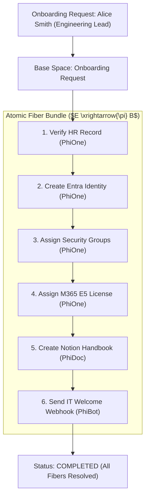

# PhiBrd: Onboarding Lifecycle & Fiber Bundle Orchestrator

`PhiBrd` coordinates complex multi-domain lifecycles. It constructs atomic **Ontologylogical Fiber Bundles** spanning HR verification, identity provisioning, group assignment, license allocation, and IT welcome automation.

---

## 1. Architectural & Fiber Bundle Flow



### Flow Diagram
```
[ New Hire Profile ]
          │
          ▼
[ PhiBrdAgent.envision() ] ──► (Validate profile fields: email, department, title, start_date)
          │
          ▼
[ PhiBrdAgent.apply() ]
          ├─► Delegate step 1-4 to PhiOne (HR & Identity)
          ├─► Delegate step 5 to PhiDoc (Handbook generation)
          └─► Delegate step 6 to PhiBot (Welcome automation)
          │
          ▼
[ PhiBrdAgent.eval() ] ──► (Verify 100% fiber bundle completion rate)
          │
          ▼
[ PhiBrdAgent.iterate() ] ──► (Emit combined onboarding receipt)
```

---

## 2. Key Components

- **`agent.py`**: `PhiBrdAgent` lifecycle implementation.
- **`onboarding.py`**: `OnboardingClient` fiber bundle pipeline.
- **`verbs.py`**: `PhiBrdVerb` typed enum constants.
- **`spec.md`**: Formal specification contract.
