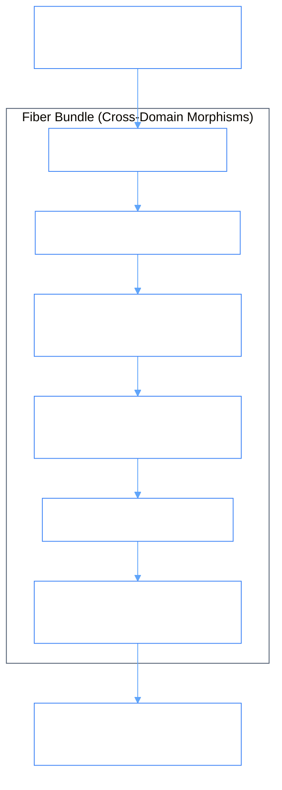

# PhiBrd: Onboarding Fiber Bundle Ontologylogy

PhiBrd coordinates complex multi-domain lifecycles by bundling operations across HR, Identity, Documentation, and Automation into an atomic topological **Fiber Bundle**.

## 1. Onboarding Fiber Bundle Structure



### Fiber Bundle Flow
```
[ Base Space: Employee Profile ]
      │
      ▼  (Fiber Projection π: E -> B)
[ 1. HR Verified ] ──► [ 2. Entra Account ] ──► [ 3. Groups ] ──► [ 4. Licenses ] ──► [ 5. Docs ] ──► [ 6. IT Webhook ]
```

## 2. Inter-Agent Dependencies & Inheritance

- **Extends**: `PhiAgent`
- **Depends on**: `phione`, `phidoc`, `phibot`, `phiora`, `philog`
- **Feeds into**: `phimen` (Executive lifecycle reporting)
