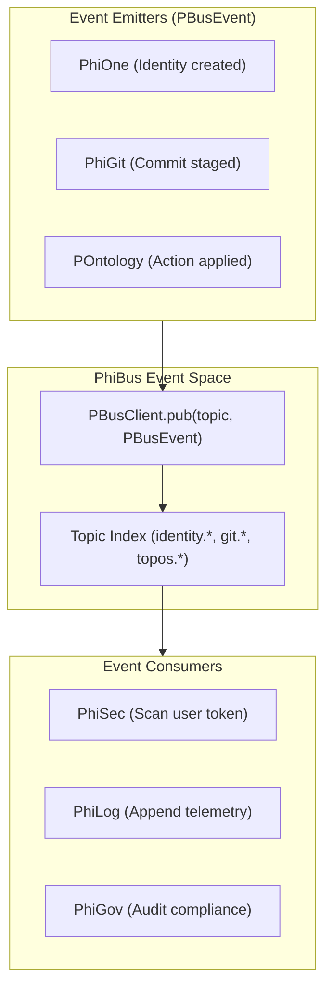
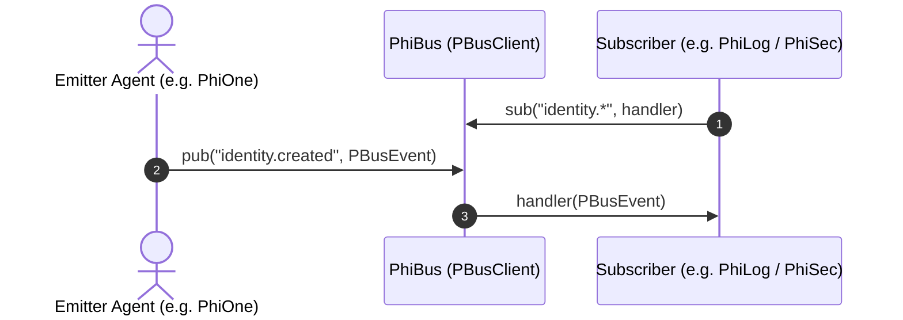

# PhiBus: Event Bus & Pub/Sub Simplicial Complex

`PhiBus` coordinates asynchronous message dispatch, event routing, and subscriber notifications across the entire topological system.

## 1. Simplicial Complex & Event Routing

## 2. PBusEvent Sequence Flow

