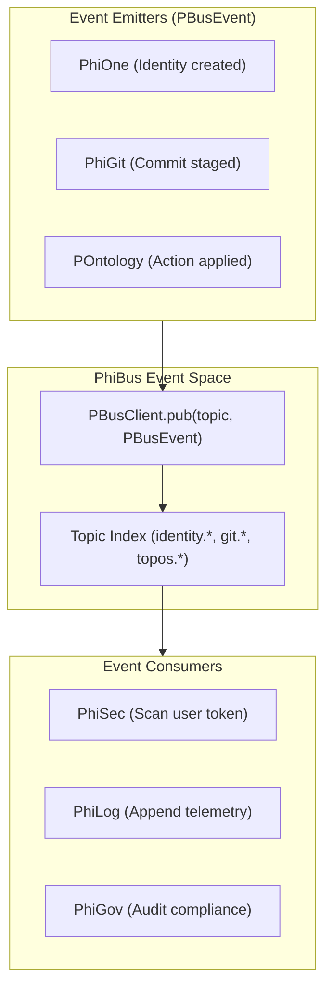

export const meta = {
  agent: "phibus",
  domain: "event_bus",
  layer: "infrastructure",
  version: "1.0.0"
};

# PhiBus: Event Bus & Pub/Sub Simplicial Complex

PhiBus manages asynchronous message dispatch and real-time event broadcasting using `PBusEvent` and pure `pub`/`sub` semantics.

