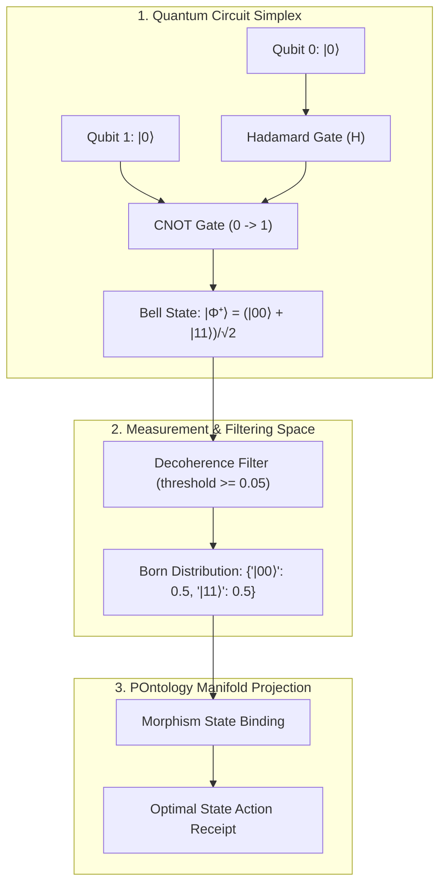

# PhiCal: Quantum Learning & Continuous Manifold Agent

`PhiCal` is the mathematical computation, quantum circuit simulation, and high-dimensional continuous manifold learning agent in Phient. It manages complex amplitude Hilbert spaces ($\mathcal{H} \cong \mathbb{C}^{2^n}$), Born-rule probability measurements, quantum logic gates, semantic superposition ranking, and gradient descent loss optimization.

---

## 1. Mathematical Foundations

### 1.1 Superposition in $n$-Qubit Hilbert Space
An $n$-qubit quantum parameter state vector $|\psi\rangle$ is represented as a linear combination of orthonormal basis vectors:
$$|\psi\rangle = \sum_{i=0}^{2^n - 1} \alpha_i |i\rangle \quad \text{where} \quad \sum_{i=0}^{2^n - 1} |\alpha_i|^2 = 1, \quad \alpha_i \in \mathbb{C}$$

### 1.2 Unitary Gate Transformations
Quantum logic gates are unitary operators ($U^\dagger U = I$) transforming state vectors:
- **Hadamard Gate ($H$)**: Creates equal superpositions from computational basis states:
  $$H = \frac{1}{\sqrt{2}} \begin{pmatrix} 1 & 1 \\ 1 & -1 \end{pmatrix}, \quad H|0\rangle = \frac{|0\rangle + |1\rangle}{\sqrt{2}}$$
- **Controlled-NOT ($CNOT$)**: Entangles two qubits (control $c$, target $t$):
  $$CNOT |c, t\rangle = |c, c \oplus t\rangle$$
- **Bell State ($|\Phi^+\rangle$)**: Maximally entangled bipartite state produced by $CNOT(H \otimes I)|00\rangle$:
  $$|\Phi^+\rangle = \frac{|00\rangle + |11\rangle}{\sqrt{2}}$$

### 1.3 Born-Rule Measurement & Decoherence Filtering
- **Born Probability**: The probability of observing eigenstate $|i\rangle$ upon projective measurement is:
  $$P(|i\rangle) = |\langle i | \psi \rangle|^2 = |\alpha_i|^2$$
- **Decoherence Filter ($\mathcal{F}_\epsilon$)**: Prunes low-probability noisy amplitudes below threshold $\epsilon$:
  $$\mathcal{F}_\epsilon(|\psi\rangle) = \{ |i\rangle \mid P(|i\rangle) \ge \epsilon \}$$

---

## 2. Architectural & Quantum Flow



### Universal Agent Lifecycle Flow
```
[ Incoming Query / Circuit Spec ]
                 │
                 ▼
[ PhiCalAgent.envision() ] ──► (Validate gate parameters, dimension 2^n, & unitary constraints)
                 │
                 ▼
[ PhiCalAgent.apply() ]
                 ├─► (CREATE_CIRCUIT)   ──► Allocate state vector |ψ⟩ in complex space
                 ├─► (SIMULATE_CIRCUIT) ──► Apply unitary gate transformations U|ψ⟩
                 ├─► (SEMANTIC_SEARCH)  ──► High-dimensional continuous manifold projection
                 └─► (TRAIN_MODEL)      ──► Execute gradient descent loss surface steps
                 │
                 ▼
[ PhiCalAgent.eval() ] ──► (Verify probability normalization sum |α|^2 = 1.0)
                 │
                 ▼
[ PhiCalAgent.iterate() ] ──► (Emit telemetry metrics & Born receipts to PhiLog)
```

---

## 3. Python SDK Usage Examples

### 3.1 Quantum Circuit Simulation (Bell State)
```python
from phiadk import PhiADKClient

client = PhiADKClient()

# Create 2-qubit circuit, apply Hadamard & CNOT, and measure
circuit = client.phical.circuit.create_circuit("bell_state", num_qubits=2)
circuit.h(0)           # Superposition on Qubit 0
circuit.cx(0, 1)       # Entangle Qubit 0 and Qubit 1
measurement = circuit.measure()

print("Observed State:", measurement["observed_state"])
print("Born Probabilities:", measurement["probabilities"])  # {'|00⟩': 0.5, '|11⟩': 0.5}
```

### 3.2 Fluent Quantum Model Language (QML)
```python
from phiadk import PhiADKClient

client = PhiADKClient()

# Method chaining with Born-rule measurement & noise filtering
qml_res = (
    client.v2.qml("classifier_space")
    .superposition(["|00⟩", "|01⟩", "|10⟩", "|11⟩"])
    .apply_gate("H", qubit=0)
    .entangle(0, 1)
    .decoherence_filter(0.15)
    .born_measurement(0.05)
    .execute()
)

print(f"Sampled State: {qml_res.observed_state}")
print(f"Probabilities: {qml_res.probabilities}")
```

### 3.3 Semantic Superposition Search
```python
from phiadk import PhiADKClient

client = PhiADKClient()

# Superposition search across semantic vector manifold
results = client.phical.search.superposition_search(
    query="quantum cryptographic entanglement",
    top_k=3,
    decoherence_threshold=0.1
)

for res in results:
    print(f"Node ID: {res['id']} | Amplitude: {res['amplitude']:.4f} | Prob: {res['prob']:.4f}")
```

### 3.4 Gradient Descent Model Parameter Training
```python
from phiadk import PhiADKClient

client = PhiADKClient()

# Train model loss surface
train_res = client.phical.training.train_step(
    model_id="topo_qnn_v1",
    learning_rate=0.01,
    steps=100
)

print(f"Initial Loss: {train_res['initial_loss']:.4f} -> Final Loss: {train_res['final_loss']:.4f}")
```

---

## 4. REST API Endpoints

### 4.1 Execute Quantum Circuit (`POST /v2/models/quantum`)
```bash
curl -X POST http://127.0.0.1:8000/v2/models/quantum \
  -H "Content-Type: application/json" \
  -d '{
    "circuit_name": "bell_circuit",
    "states": ["|00⟩", "|01⟩", "|10⟩", "|11⟩"],
    "gates": ["H:0", "CNOT:0:1"],
    "decoherence_threshold": 0.15,
    "measurement_threshold": 0.05
  }'
```

**Response**:
```json
{
  "circuit_name": "bell_circuit",
  "observed_state": "|00⟩",
  "probabilities": {
    "|00⟩": 0.5,
    "|11⟩": 0.5
  },
  "states_count": 2,
  "confidence": 1.0
}
```

### 4.2 Query QML Parameter Circuit (`GET /v2/query/qml`)
```bash
curl -X GET "http://127.0.0.1:8000/v2/query/qml?circuit=bell_state&gates=H:0,CNOT:0:1&threshold=0.1"
```

---

## 5. Key Modules & Package Structure

| File | Purpose |
| :--- | :--- |
| [`agent.py`](./phient/src/phiadk/phical/agent.py) | `PhiCalAgent` 4-phase universal recursive lifecycle. |
| [`circuit.py`](./phient/src/phiadk/phical/circuit.py) | `CircuitClient` for unitary quantum gate transformations. |
| [`semantic_search.py`](./phient/src/phiadk/phical/semantic_search.py) | `SemanticSearchClient` for superposition document search. |
| [`training.py`](./phient/src/phiadk/phical/training.py) | `TrainingClient` for gradient descent parameter training. |
| [`models.py`](./phient/src/phiadk/phical/models.py) | Mathematical dataclasses (`QubitState`, `QuantumCircuitModel`). |
| [`spec.md`](./phient/src/phiadk/phical/spec.md) | Formal specification contract. |
| [`uses.md`](./phient/src/phiadk/phical/uses.md) | Copy-pasteable Python code examples. |
| [`topo.md`](./phient/src/phiadk/phical/topo.md) | Ontologylogical manifold specification. |
| [`topo/topology.mdx`](./phient/src/phiadk/phical/topo/topology.mdx) | MDX live diagram topology document. |
