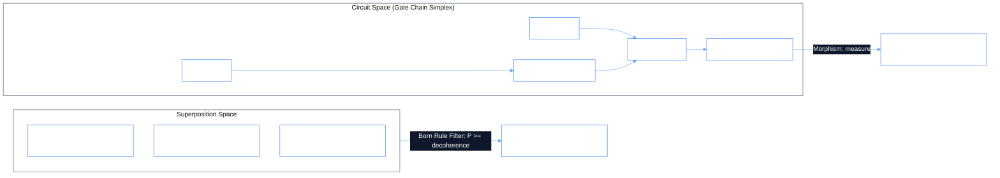
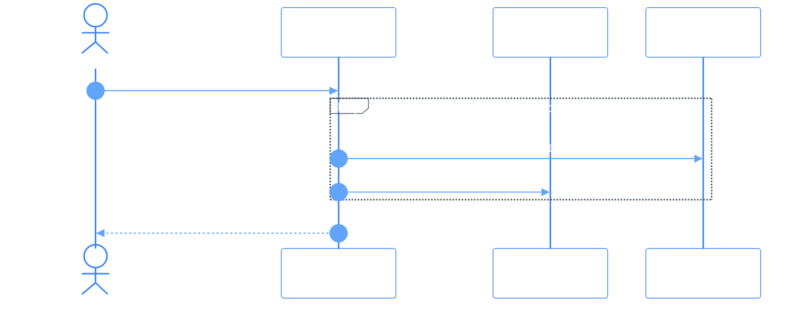

# PhiCal: Quantum Learning & Superposition Ontologylogy

PhiCal models semantic retrieval and quantum circuits as topological vector spaces over complex amplitudes ($\mathbb{C}^N$), scoring relevance through the Born rule ($P = |\alpha|^2$) and decoherence filtering.

## 1. Quantum Simplicial Circuit & Semantic Space



### Tensor Flow
```
|ψ⟩ = α|Doc A⟩ + β|Doc B⟩ + γ|Doc C⟩
  │
  ├─► [ Born Measurement: P(A) = |α|² ] ──► (Above decoherence threshold 0.25) ──► Retained
  ├─► [ Born Measurement: P(B) = |β|² ] ──► (Above decoherence threshold 0.25) ──► Retained
  └─► [ Born Measurement: P(C) = |γ|² ] ──► (Decoheres / Collapse to 0)       ──► Pruned
```

## 2. Gradient Descent Training Morphism



## 3. Inter-Agent Dependencies & Inheritance

- **Extends**: `PhiAgent`
- **Depends on**: `phiora` (Vector records & embeddings)
- **Feeds into**: `qml` (Quantum query language), `phimen` (Optimization parameters)
