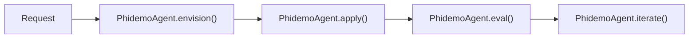

# Phidemo: demo Domain Agent

`Phidemo` coordinates demo topological operations and state mutations with version `1.5.0`.

---

## 1. Architectural Flow



---

## 2. Python SDK Usage

```python
from phiadk import PhiADKClient

client = PhiADKClient()
agent = client.agents["phidemo"]
print(f"Agent Version: {agent.version}")
```
