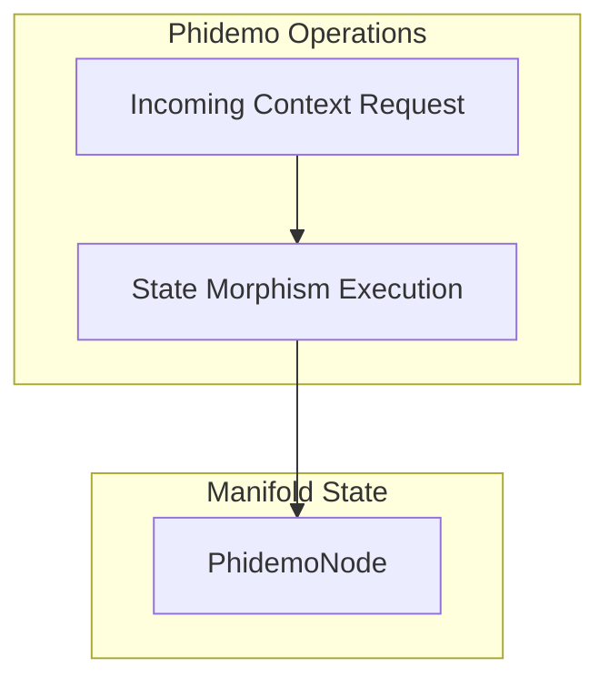

# Phidemo: demo Simplicial Complex

The `Phidemo` domain agent manages the `demo` manifold space.

## 1. Simplicial Complex Ontologylogy

```mermaid
graph TD
    subgraph Operations["Phidemo Operations"]
        Req["Incoming Context Request"]
        Morph["State Morphism Execution"]
    end

    subgraph State["Manifold State"]
        Node["PhidemoNode"]
    end

    Req --> Morph
    Morph --> Node
```
