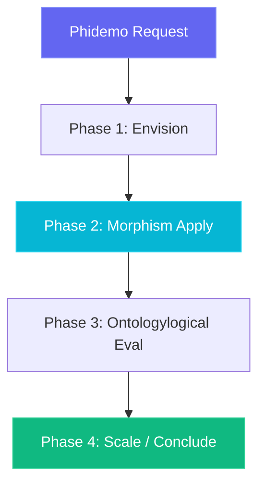

# Phidemo Ontologylogical Architecture

The **Phidemo** agent orchestrates the **demo** topology space with version `1.5.0`.

## Simplicial Ontologylogy Flow

## Supported Verbs

- `demo_action`
- `demo_status`
