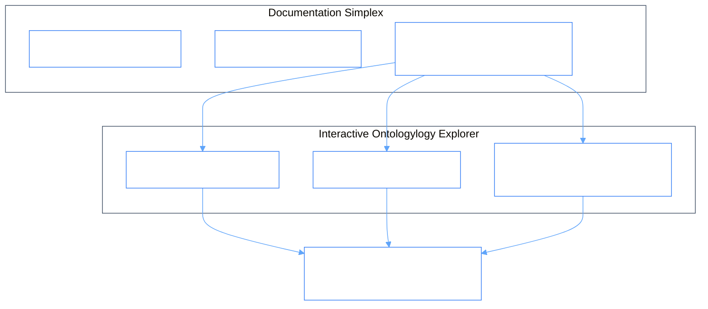

# PhiDoc: Documentation & Workspace Ontologylogy Agent

`PhiDoc` manages workspace documentation, Notion page trees, engineering handbooks, and automatic compilation and rendering of agent `topo.md` / `topology.mdx` cards.

---

## 1. Architectural & Presentation Flow



### Flow Diagram
```
[ Browser / API / CLI ]
           │
           ▼
[ PhiDocAgent.envision() ] ──► (Verify document path & markdown tree structure)
           │
           ▼
[ PhiDocAgent.apply() ]
           ├─► (SEARCH_DOCS)           ──► Search workspace documentation pages
           ├─► (CREATE_PAGE)           ──► Create new Notion / markdown page
           ├─► (GET_TOPOLOGY)          ──► Load and parse agent `topo.md` / `topology.mdx`
           └─► (SYNC_KNOWLEDGE_BASE)   ──► Sync markdown pages to vector index
           │
           ▼
[ PhiDocAgent.eval() ] ──► (Verify markdown syntax & Mermaid diagrams)
           │
           ▼
[ PhiDocAgent.iterate() ] ──► (Return rendered documentation card)
```

---

## 2. Key Components

- **`agent.py`**: `PhiDocAgent` lifecycle implementation.
- **`docs.py`**: `PageClient`, `SearchClient`, `OntologylogyExplorerClient`.
- **`verbs.py`**: `PhiDocVerb` typed enum constants.
- **`spec.md`**: Formal specification contract.
