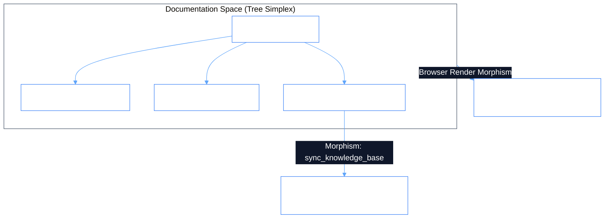
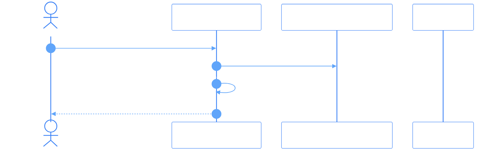

# PhiDoc: Documentation & Workspace Knowledge Ontologylogy

PhiDoc maintains the hierarchical documentation topology connecting Notion workspaces, Markdown repositories, and agent `.mdx` architecture cards for automated web documentation rendering.

## 1. Documentation Space Ontologylogy



### Document Tree
```
[ Workspace Root ]
       │
       ├─► [ Engineering Handbook ]
       ├─► [ Operations Runbooks ]
       └─► [ Agent Ontologylogy Hub ]
                 ├─► phione/topo.md
                 ├─► phical/topo.md
                 ├─► phigit/topo.md
                 └─► phimen/topo.md
```

## 2. Dynamic MDX Auto-Presentation Flow



## 3. Inter-Agent Dependencies & Inheritance

- **Extends**: `PhiAgent`
- **Depends on**: `phiora` (Document datasets), `phigit` (Doc history)
- **Feeds into**: `phirag` (Knowledge chunking), `topos` (Auto-documentation presentation)
