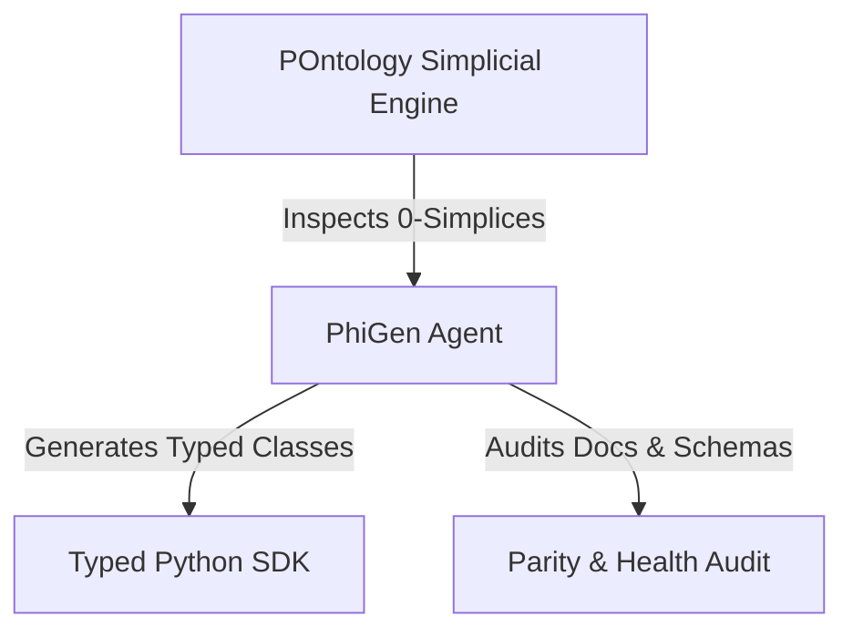

# PhiGen: Code Generation & Parity Verification Engine

PhiGen is the code synthesis and Palantir parity auditing agent for the Phient Developer Platform.



## Capabilities
- **Typed SDK Code Generation**: Automatically generates strongly-typed Python classes with IDE autocompletion for any `ObjectType` registered in POntology.
- **Palantir Parity Auditing**: Inspects the entire codebase against `REFS/palantir/foundry-platform-python/` to ensure 100% architectural and documentation parity.
- **Specification Compilation**: Validates all 15 domain agent `schema.json` files for consistent `spec_idx`, tasks, and verbs.

## Quickstart
```python
from phiadk import PhiADKClient

client = PhiADKClient()

# Generate typed dataclasses for all registered POntology object types
result = client.phigen.generate_types()
print(f"Generated {result['count']} typed classes:")
print(result["code"])

# Run 1-click Parity Audit
audit = client.phigen.audit_parity()
print(f"Palantir Parity: {audit.parity_percentage}% ({audit.status})")
```
