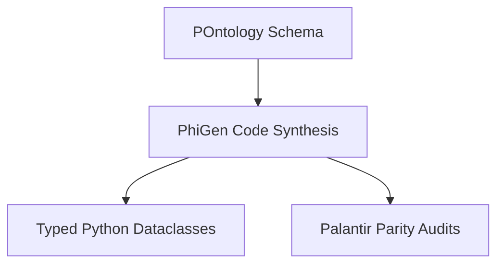

export const meta = {
  agent_id: "phigen",
  domain: "code_generation",
  layer: "engine",
  version: "1.0.0"
};

# PhiGen Ontologylogy

```mermaid
graph TD
  Schema["POntology Schema"] --> Gen["PhiGen Code Synthesis"]
  Gen --> Types["Typed Python Dataclasses"]
  Gen --> Parity["Palantir Parity Audits"]
```
