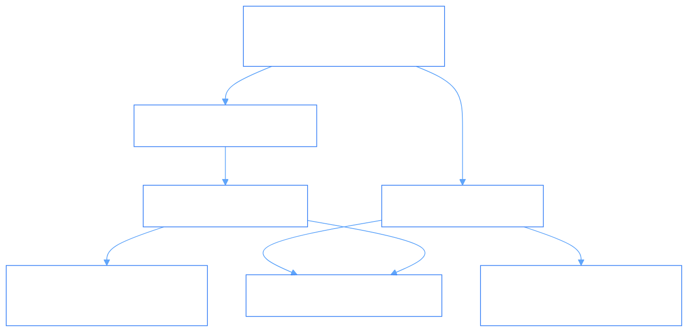

# PhiGit: Cryptographic Git-Core Storage Engine Agent

`PhiGit` provides content-addressable storage, cryptographic SHA-1 hashing, immutable `Blob` storage, hierarchical `Tree` construction, and parent-linked `Commit` lineage graphs.

---

## 1. Cryptographic DAG Architecture & Flow



### Flow Diagram
```
[ Write Payload / Raw Content ]
                │
                ▼
[ PhiGitAgent.envision() ] ──► (Verify payload type: bytes or string)
                │
                ▼
[ PhiGitAgent.apply() ]
                ├─► (STORE_BLOB) ──► Compute SHA-1 & persist Blob
                ├─► (STORE_TREE) ──► Construct deterministic Tree entries
                ├─► (COMMIT)     ──► Link tree to parent commit hash
                └─► (DIFF)       ──► Compute delta between two tree SHAs
                │
                ▼
[ PhiGitAgent.eval() ] ──► (Verify hash integrity)
                │
                ▼
[ PhiGitAgent.iterate() ] ──► (Advance branch reference: refs/heads/main)
```

---

## 2. Key Components

- **`agent.py`**: `PhiGitAgent` lifecycle implementation.
- **`engine.py`**: `GitEngine` with blob, tree, commit, and ref storage.
- **`models.py`**: `Blob`, `Tree`, `TreeEntry`, `Commit`, `Ref`.
- **`verbs.py`**: `PhiGitVerb` typed enum constants.
- **`spec.md`**: Formal specification contract.
