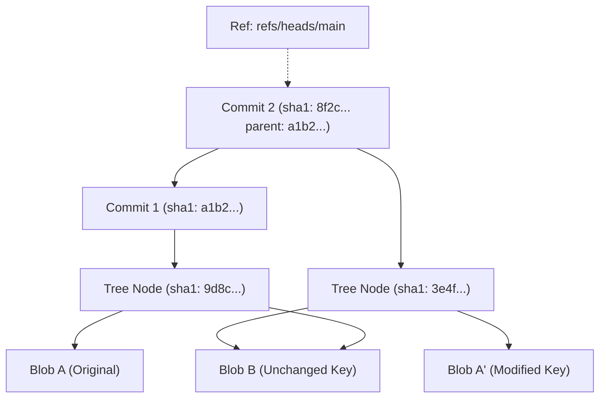

import { AgentOntologylogy, Mermaid, SimplexBadge } from '@phiegg/components'

# PhiGit: Git-Core Storage Engine Ontologylogy

<SimplexBadge layer="Data" simplex="Directed Acyclic Graph (DAG) of Hashes" version="1.0.0" />

PhiGit implements a content-addressable object store. Every piece of state is stored as an immutable `Blob`, structured into `Tree` hierarchies, and snapshotted as `Commit` nodes in a cryptographic lineage graph.

## 1. Cryptographic DAG & Object Tree



### ASCII Graph Lineage
```
[ refs/heads/main ] ──► (Commit B: sha1=7c2e...) ──► (Commit A: sha1=1f4a...)
                              │                              │
                              ▼                              ▼
                         [ Tree B ]                     [ Tree A ]
                         /        \                     /        \
                    [ Blob 1' ]  [ Blob 2 ]        [ Blob 1 ]  [ Blob 2 ]
```

## 2. Inter-Agent Dependencies & Inheritance

- **Extends**: `PhiAgent`
- **Depends on**: None (Foundational primitive)
- **Feeds into**: `phiora`, `philog`, `phidoc`, `phimen`
