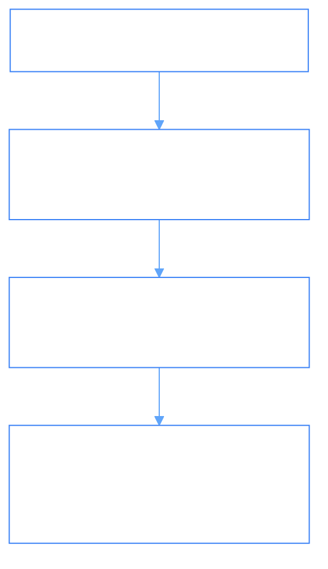

# PhiGov: Governance, Compliance & Lineage Domain Agent

`PhiGov` is the enterprise governance and compliance agent. It evaluates regulatory standards (GDPR, SOC2, HIPAA, ISO27001), audits data transformation provenance, and enforces governance constraints.

---

## 1. Architectural & Governance Flow



### Flow Diagram
```
[ Audit Trigger / Regulatory Query ]
                 │
                 ▼
[ PhiGovAgent.envision() ] ──► (Determine regulation scope: GDPR, SOC2, etc.)
                 │
                 ▼
[ PhiGovAgent.apply() ]
                 ├─► (CHECK_COMPLIANCE)    ──► Evaluate PII encryption & access
                 ├─► (AUDIT_LINEAGE)       ──► Trace dataset commit history to origin
                 ├─► (GET_COMPLIANCE_SCORE)──► Calculate multi-standard index
                 └─► (REGISTER_REGULATION) ──► Add custom policy rule
                 │
                 ▼
[ PhiGovAgent.eval() ] ──► (Verify score >= 0.95 minimum compliance threshold)
                 │
                 ▼
[ PhiGovAgent.iterate() ] ──► (Return compliance report & emit audit to PhiLog)
```

---

## 2. Python SDK Usage

```python
from phiadk import PhiADKClient

client = PhiADKClient()

# Check GDPR compliance across the platform
report = client.phigov.check_compliance("GDPR")
print(f"Compliance Score: {report.score * 100}%")
print(f"Findings: {report.findings}")
```
