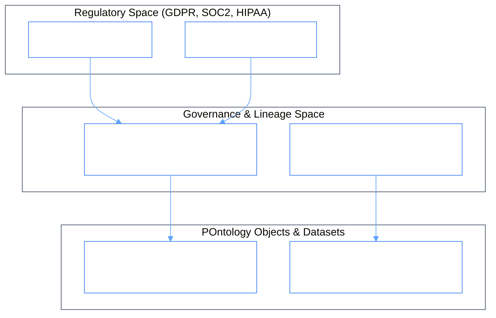

# PhiGov: Governance & Lineage Simplicial Complex

`PhiGov` manages enterprise compliance, data lineage, policy regulations, and audit scores across all topological simplicial spaces.

## 1. Simplicial Complex & Governance Ontologylogy

