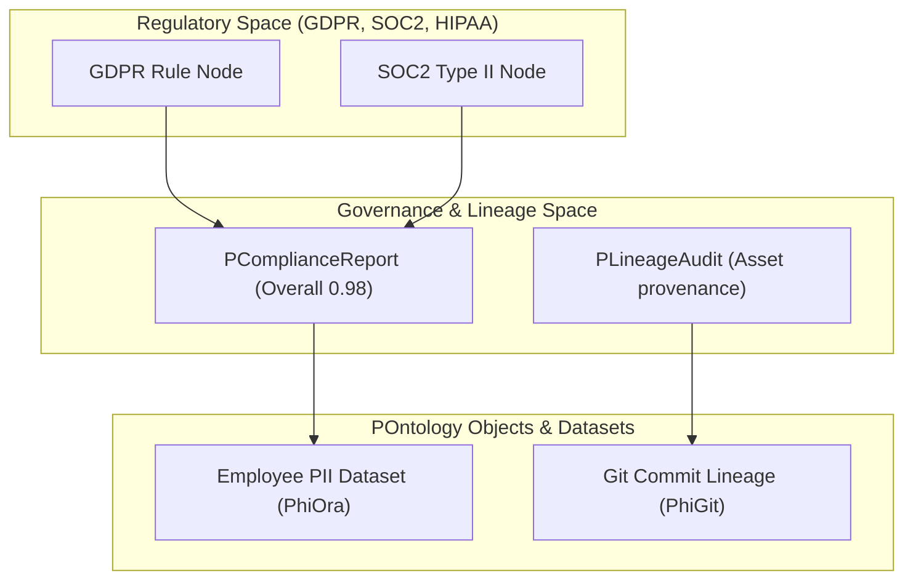

export const meta = {
  agent: "phigov",
  domain: "governance",
  layer: "executive",
  version: "1.0.0"
};

# PhiGov: Governance & Lineage Simplicial Complex

PhiGov evaluates regulatory compliance (GDPR, SOC2, HIPAA), audits data lineage, and maintains enterprise governance policies.

