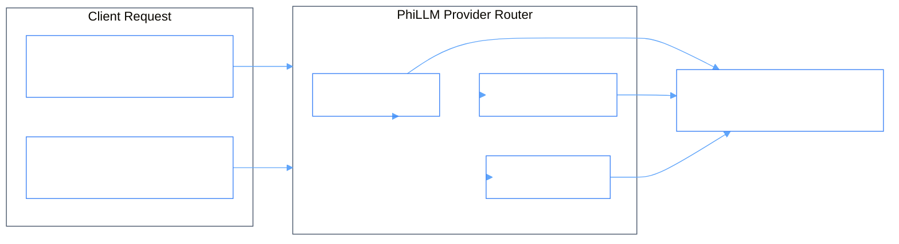

# PhiLLM: Language Model Multi-Provider Gateway Agent

`PhiLLM` provides unified inference access across OpenAI, Anthropic, Google Gemini, and local LLMs. It manages prompt formatting, token metrics, parameter overrides, and streaming SSE responses.

---

## 1. Architectural & Inference Flow



### Flow Diagram
```
[ User / Agent Prompt ]
            │
            ▼
[ PhiLLMAgent.envision() ] ──► (Select active model & resolve provider)
            │
            ▼
[ PhiLLMAgent.apply() ]
            ├─► (COMPLETE / CHAT) ──► Execute chat completion & track token usage
            ├─► (EMBED)           ──► Generate dense text vector embeddings
            ├─► (COUNT_TOKENS)    ──► Approximate token count
            └─► (SET_PARAMS)      ──► Update temperature / max_tokens
            │
            ▼
[ PhiLLMAgent.eval() ] ──► (Verify response non-empty & token within limits)
            │
            ▼
[ PhiLLMAgent.iterate() ] ──► (Return completion payload with usage metadata)
```

---

## 2. Key Components

- **`agent.py`**: `PhiLLMAgent` lifecycle implementation.
- **`open_ai_model.py`**: `OpenAiModelClient` multi-provider bridge.
- **`models.py`**: `ChatCompletionResponse`, `Usage`, `ModelConfig`.
- **`verbs.py`**: `PhiLLMVerb` typed enum constants.
- **`spec.md`**: Formal specification contract.
