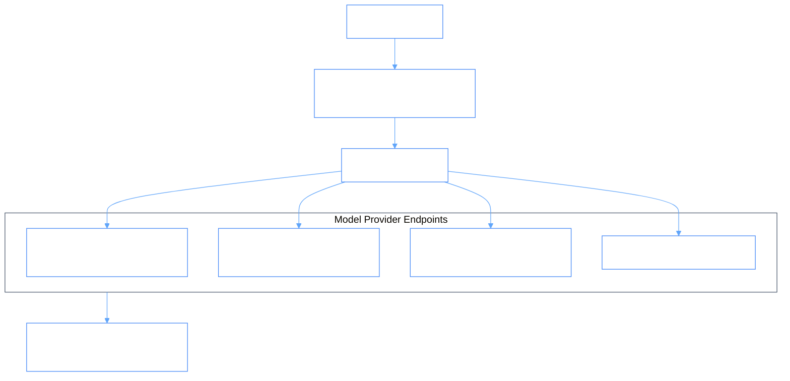

# PhiLLM: Language Models & Multi-Provider Ontologylogy

PhiLLM encapsulates model endpoints across OpenAI, Anthropic, Gemini, and local LLMs. It manages parameters, token metrics, raw responses, and streaming SSE pipes.

## 1. Provider Multiplexing Ontologylogy



### Provider Pipeline
```
[ RequestInfo ] ──► [ Provider Router ] ──► [ OpenAI / Anthropic / Gemini ]
                            │
                            ▼
      [ with_raw_response / with_streaming_response ]
```

## 2. Inter-Agent Dependencies & Inheritance

- **Extends**: `PhiAgent`
- **Depends on**: `phiora` (Profile config persistence)
- **Feeds into**: `phirag`, `phimen`, `phidoc`
