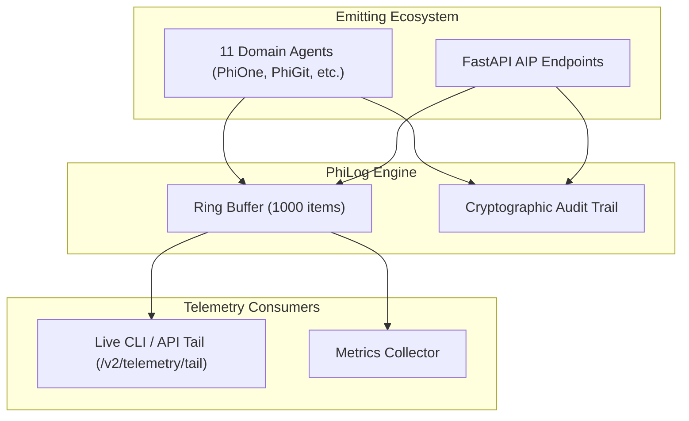

# PhiLog: Telemetry & Observability Agent

`PhiLog` is the observability backbone. It records structured logs, maintains a 1000-entry in-memory ring buffer, exports real-time SSE streams, and links immutable audit records directly to `PhiGit` SHA-1 commits.

---

## 1. Architectural & Telemetry Flow



### Flow Diagram
```
[ Telemetry Event: log(INFO, "User provisioned") ]
                        │
                        ▼
[ PhiLogAgent.envision() ] ──► (Format timestamp, agent_id, and log level)
                        │
                        ▼
[ PhiLogAgent.apply() ]
                        ├─► (LOG / INFO / WARN) ──► Append to in-memory ring buffer
                        ├─► (RECORD_AUDIT)      ──► Link action to Git SHA-1 commit
                        ├─► (TAIL)              ──► Stream latest N records
                        └─► (QUERY)             ──► Filter by level and agent_id
                        │
                        ▼
[ PhiLogAgent.eval() ] ──► (Verify log delivery & audit persistence)
                        │
                        ▼
[ PhiLogAgent.iterate() ] ──► (Return log record or audit receipt)
```

---

## 2. Key Components

- **`agent.py`**: `PhiLogAgent` lifecycle implementation.
- **`logger.py`**: `StructuredLogger` ring buffer & audit tracker.
- **`models.py`**: `LogRecord`, `LogLevel`, `AuditEntry`.
- **`verbs.py`**: `PhiLogVerb` typed enum constants.
- **`spec.md`**: Formal specification contract.
