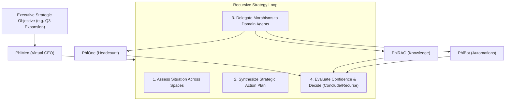

# PhiMen: Virtual CEO & Strategic Orchestration Agent

`PhiMen` acts as the Virtual CEO. It evaluates high-level executive objectives across all domain spaces (`phione`, `phical`, `phirag`, `phidoc`, `phibot`, `phibrd`), synthesizes strategic plans, and delegates atomic tasks recursively.

---

## 1. Architectural & Strategic Synthesis Flow



### Flow Diagram
```
[ Executive Goal: "Launch Global Expansion" ]
                      │
                      ▼
[ PhiMenAgent.envision() ] ──► (Survey all 10 domain agent spaces)
                      │
                      ▼
[ PhiMenAgent.apply() ]
                      ├─► (ASSESS_OBJECTIVE)  ──► Decompose goal into domain tasks
                      ├─► (DELEGATE_STRATEGY) ──► Construct strategic Fiber bundle
                      └─► (SYNTHESIZE_REPORT) ──► Aggregate sub-agent outputs
                      │
                      ▼
[ PhiMenAgent.eval() ] ──► (Compute cross-domain completion confidence)
                      │
                      ▼
[ PhiMenAgent.iterate() ]
                      ├─► (confidence >= 0.8) ──► "conclude"
                      ├─► (depth < max_depth)  ──► "recurse" (refine objective)
                      └─► (otherwise)          ──► "escalate"
```

---

## 2. Key Components

- **`executive.py`**: `ExecutiveAgent` (`PhiMenAgent`) lifecycle implementation.
- **`card.py`**: `PHIMEN_CARD` definition.
- **`verbs.py`**: `PhiMenVerb` typed enum constants.
- **`spec.md`**: Formal specification contract.
