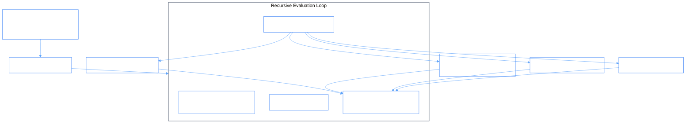

# PhiMen: Virtual CEO & Strategic Orchestration Ontologylogy

PhiMen acts as the Virtual CEO. It evaluates high-level executive objectives by surveying all domain spaces (`phione`, `phirag`, `phical`, `phibot`, `phibrd`), synthesizing strategic plans, and delegating sub-tasks recursively.

## 1. Global Executive Manifold



### Executive Space Coordination
```
[ Virtual CEO: PhiMen ]
           │
           ├─► [ Assess: Cross-Domain Survey ]
           ├─► [ Synthesize: Action Plan ]
           ├─► [ Delegate: Atomic Morphisms ] ──► [ Domain Agents (phi*) ]
           └─► [ Iterate: Feedback Loop & Decision ]
```

## 2. Inter-Agent Dependencies & Inheritance

- **Extends**: `PhiAgent`
- **Depends on**: All domain clients (`phione`, `phical`, `phirag`, `phidoc`, `phibot`, `phibrd`, `phiora`, `phigit`, `philog`, `phillm`)
- **Feeds into**: System orchestrator and executive reporting dashboards
