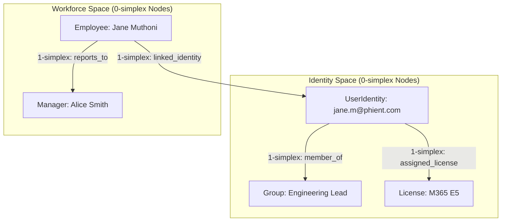

# PhiOne: Workforce & Identity Domain Agent

`PhiOne` is the foundational infrastructure agent responsible for workforce operations, identity provisioning (Microsoft Entra ID), employee hierarchies (HiBob), security groups, and leave balance manifolds.

---

## 1. Architectural Space & Simplicial Complex



### Flow Diagram
```
[ User Request / API ]
       │
       ▼
[ PhiOneAgent.envision() ] ──► (Verify parameters & schema)
       │
       ▼
[ PhiOneAgent.apply() ]
       ├─► (LOOKUP_EMPLOYEE)   ──► Resolve via HiBob DataSet
       ├─► (PROVISION_IDENTITY) ──► Morphism to Entra ID Space
       ├─► (ASSIGN_LICENSE)    ──► Mutate License Manifold
       └─► (GET_LEAVE_BALANCE)  ──► Query Leave Balance Table
       │
       ▼
[ PhiOneAgent.eval() ] ──► (Calculate confidence >= 0.9)
       │
       ▼
[ PhiOneAgent.iterate() ] ──► (Commit receipt to PhiLog & PhiGit)
```

---

## 2. Key Components

- **`agent.py`**: `PhiOneAgent` lifecycle subclass of `PhiAgent`.
- **`employee.py`**: `EmployeeClient` for directory lookups and org-chart traversals.
- **`identity.py`**: `IdentityClient` for Entra ID users, groups, and licenses.
- **`leave.py`**: `LeaveClient` for PTO and annual leave balance manifolds.
- **`verbs.py`**: `PhiOneVerb` typed action enum constants.
- **`tasks.py`**: `PhiOneTask` task enum constants.
- **`specs.py`**: `PhiOneSpec` specification constants.
- **`spec.md`**: Formal specification contract.
