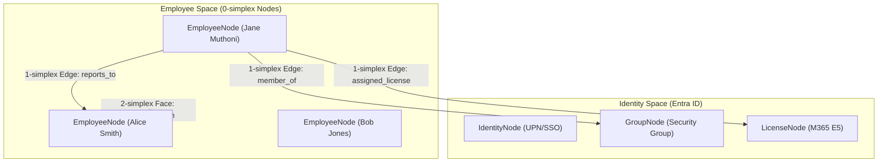
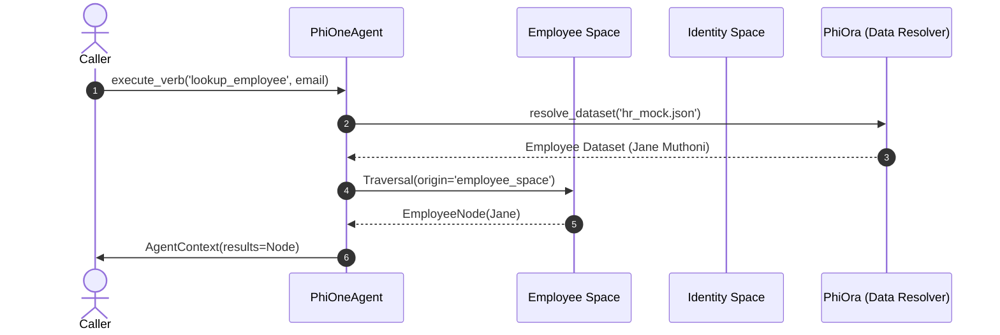

import { AgentOntologylogy, Mermaid, SimplexBadge } from '@phiadk/components'

# PhiOne: Identity & Workforce Ontologylogy

<SimplexBadge layer="Infrastructure" simplex="0-simplex, 1-simplex" version="1.0.0" />

PhiOne manages the connected topological spaces of enterprise identity, Microsoft Entra ID accounts, employee hierarchy simplexes, and leave balance manifolds.

## 1. Simplicial Structure & Spaces



### ASCII Space Representation
```
[ Global Ontologylogy ]
       │
       ├─► [ Employee Space ] ──(reports_to)──► [ Org Tree 2-Simplex ]
       │         │
       │         └─► (account_link) ──► [ Identity Space ]
       │                                       │
       │                                       ├─► [ Security Groups ]
       │                                       └─► [ License Manifolds ]
       └─► [ Leave Balance Space ]
```

## 2. Morphisms & Morphic Flow



## 3. Inter-Agent Dependencies & Inheritance

- **Extends**: `PhiAgent`
- **Depends on**: `phiora` (Dataset resolution), `phigit` (Lineage commits)
- **Feeds into**: `phibrd` (Onboarding fiber bundles), `phimen` (Executive headcount analysis)
