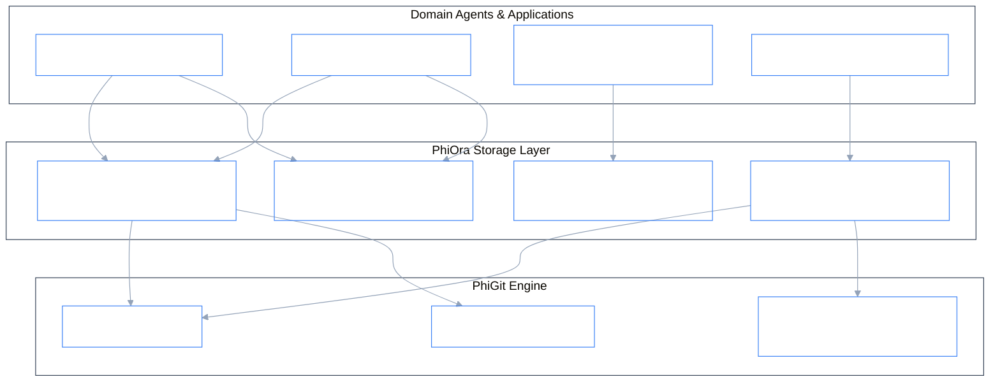
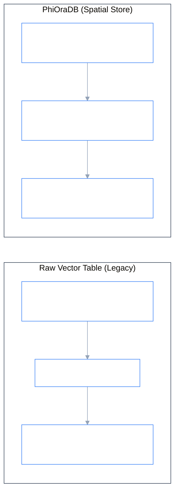

# PhiOra: Spatial & Content-Addressed Storage Layer Agent (PhiOraDB)

`PhiOra` is the single point of truth for data resolution, topological spatial storage (**PhiOraDB**), and content-addressed immutable dataset lineage.

---

## 1. Architectural & Spatial Store Diagram



---

## 2. Spatial Store vs Raw Vector Store



---

## 3. Execution Lifecycle

```
[ Spatial Record Mutation / Dataset Write ]
                 │
                 ▼
[ PhiOraAgent.envision() ] ──► (Verify spatial coordinates, manifold & schema)
                 │
                 ▼
[ PhiOraAgent.apply() ]
                 ├─► (SPATIAL_INSERT)   ──► Insert coordinate entity into spatial manifold
                 ├─► (SPATIAL_QUERY)    ──► Geodesic k-NN & bounding box containment
                 ├─► (PUT_RECORD)       ──► Hash blob & commit via PhiGit engine
                 ├─► (RESOLVE_DATASET)  ──► Resolve immutable file system / remote snapshot
                 │
                 ▼
[ PhiOraAgent.eval() ] ──► (Verify SHA-1 integrity & spatial bounds)
                 │
                 ▼
[ PhiOraAgent.iterate() ] ──► (Emit storage telemetry to PhiLog & PhiBus)
```

---

## 4. Key Components

- **`agent.py`**: `PhiOraAgent` lifecycle implementation (`envision` $\rightarrow$ `apply` $\rightarrow$ `eval` $\rightarrow$ `iterate`).
- **`store.py`**: `PhiOraDB`, `SpatialStore`, `StoreClient`, `ResolverClient`, `VectorClient`.
- **`models.py`**: `SpatialRecord`, `Record`, `DataSet`, `Collection`, `Store`.
- **`card.py`**: Agent metadata registration (`AgentLayer.STORAGE`).
