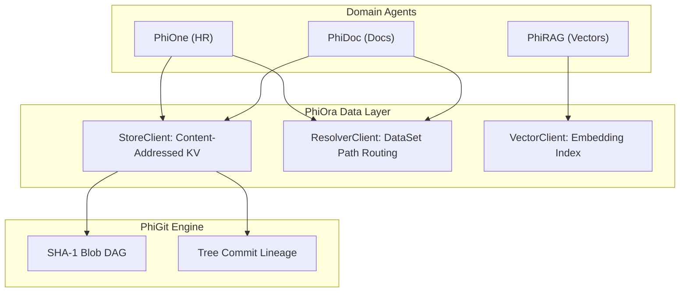

# PhiOra: Data Layer & Content-Addressed Store Agent

`PhiOra` is the single point of truth for data resolution and content-addressed storage. It routes key-value mutations to `PhiGit` SHA-1 tree commits, indexes vector embeddings, and provides deterministic `DataSet` path resolution.

---

## 1. Architectural & Data Flow



### Flow Diagram
```
[ Key-Value Mutation / Vector Write ]
                 │
                 ▼
[ PhiOraAgent.envision() ] ──► (Verify collection name & data format)
                 │
                 ▼
[ PhiOraAgent.apply() ]
                 ├─► (PUT_RECORD)       ──► Hash blob & commit via PhiGit engine
                 ├─► (GET_RECORD)       ──► Retrieve content-addressed value
                 ├─► (INDEX_VECTOR)     ──► Insert high-dimensional vector
                 └─► (RESOLVE_DATASET)  ──► Resolve file system / remote source
                 │
                 ▼
[ PhiOraAgent.eval() ] ──► (Verify SHA-1 integrity & commit checksum)
                 │
                 ▼
[ PhiOraAgent.iterate() ] ──► (Emit storage telemetry to PhiLog)
```

---

## 2. Key Components

- **`agent.py`**: `PhiOraAgent` lifecycle implementation.
- **`store.py`**: `StoreClient`, `ResolverClient`, `VectorClient`.
- **`models.py`**: `Record`, `DataSet`, `VectorRecord`.
- **`verbs.py`**: `PhiOraVerb` typed enum constants.
- **`spec.md`**: Formal specification contract.
