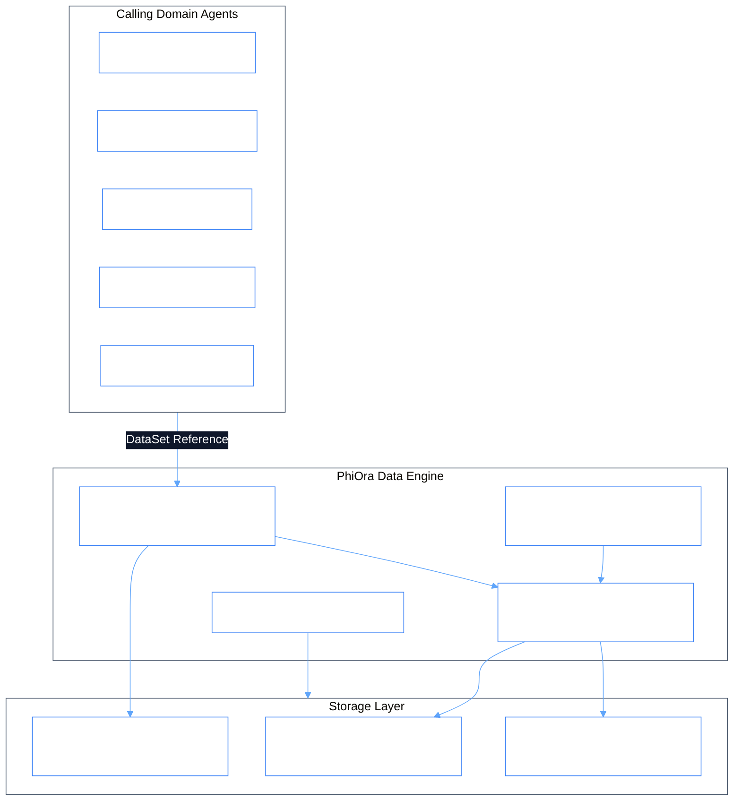

# PhiOra: Data Layer & Content-Addressed Ontologylogy

PhiOra is the single point of data I/O for the entire ecosystem. It enforces strict mathematical data-as-sets separation, key-value storage, vector indexing, and Git-backed tree state resolution.

## 1. Storage Ontologylogy & DataSet Resolution



### Key-Value & Tree Mapping
```
[ Key/Value Store ] ──► [ Collection Tree ] ──► [ SHA-1 Blobs ]
        │                       │                     │
        ├─► put(k, v)           ├─► TreeEntry(k, sha) ├─► Blob(content, sha)
        ├─► get(k)              └─► Commit Lineage    └─► Immutable
        └─► keys(), values()
```

## 2. Inter-Agent Dependencies & Inheritance

- **Extends**: `PhiAgent`
- **Depends on**: `phigit` (Object & tree persistence), `philog` (Audit trail)
- **Feeds into**: All domain agents (`phione`, `phical`, `phirag`, `phidoc`, `phibot`, `phibrd`, `phillm`, `phimen`) and `topos` ontology engine.
