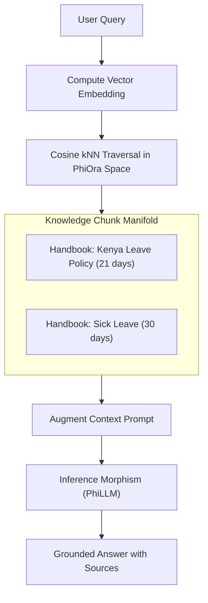

# PhiRAG: Knowledge Retrieval & Augmentation Agent

`PhiRAG` is the semantic data retrieval agent. It splits documents into semantic chunks, manages vector indices in `PhiOra`, computes nearest-neighbor traversals, and augments LLM prompts with grounded context.

---

## 1. Architectural & RAG Flow



### Flow Diagram
```
[ Query: "What is leave policy?" ]
               │
               ▼
[ PhiRAGAgent.envision() ] ──► (Map query to prompt space)
               │
               ▼
[ PhiRAGAgent.apply() ]
               ├─► (RETRIEVE) ──► kNN nearest neighbor search over PhiOra vectors
               ├─► (GENERATE) ──► Structure-preserving context morphism via PhiLLM
               └─► (INDEX)    ──► Semantic chunking and vector storage
               │
               ▼
[ PhiRAGAgent.eval() ] ──► (Verify groundedness score & source citations)
               │
               ▼
[ PhiRAGAgent.iterate() ] ──► (Return final grounded context response)
```

---

## 2. Key Components

- **`agent.py`**: `PhiRAGAgent` lifecycle implementation.
- **`retrieval.py`**: `RetrievalClient` and `GenerationClient`.
- **`verbs.py`**: `PhiRAGVerb` typed enum constants.
- **`spec.md`**: Formal specification contract.
