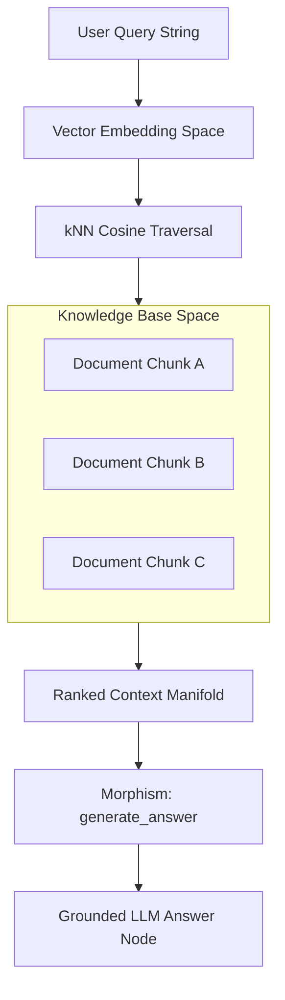
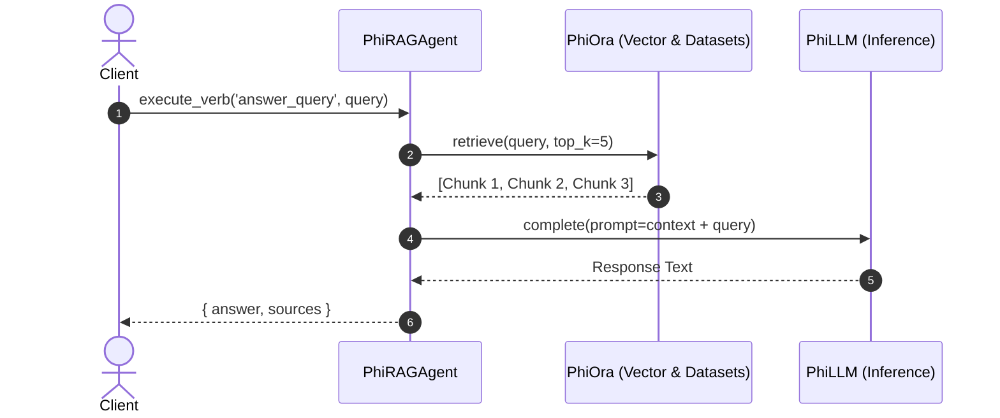

# PhiRAG: Knowledge Retrieval & Augmentation Ontologylogy

PhiRAG maps unstructured document chunks into high-dimensional embedding spaces, executes semantic nearest-neighbor traversals, and applies structure-preserving morphisms to generate grounded LLM contexts.

## 1. RAG Ontologylogical Pipeline



### Space Representation
```
[ Query ] ──► [ Dense Vector ] ──(kNN Cosine)──► [ Knowledge Space (Collections) ]
                                                              │
                                                              ▼
[ Grounded Answer ] ◄──(LLM Generation Morphism)── [ Context Manifold ]
```

## 2. Morphism Data Flow



## 3. Inter-Agent Dependencies & Inheritance

- **Extends**: `PhiAgent`
- **Depends on**: `phiora` (Vector similarity search), `phillm` (Model generation)
- **Feeds into**: `phimen` (Executive decision context), `phidoc` (Doc generation)
