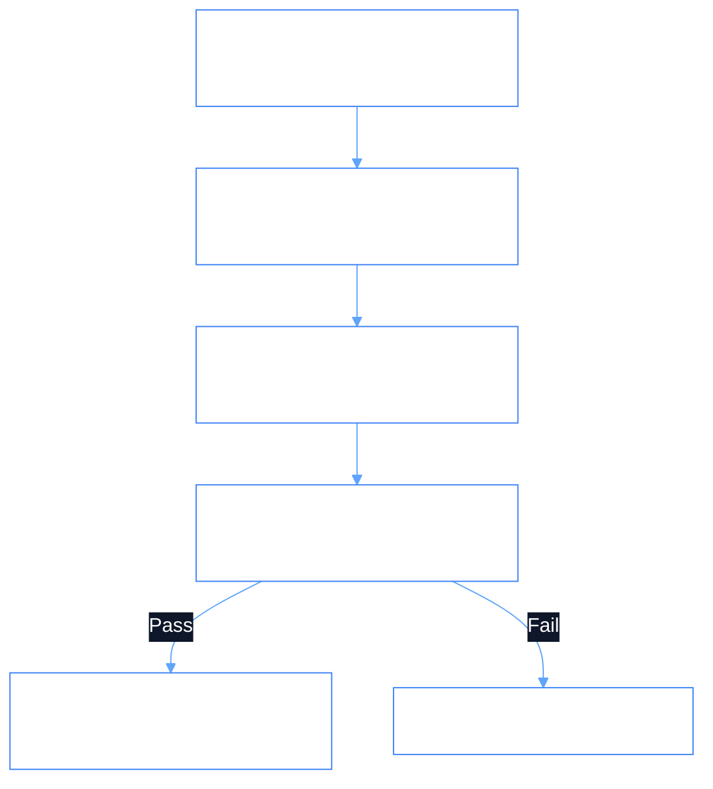

# PhiSec: Security & Vulnerability Domain Agent

`PhiSec` is the security governance agent. It performs vulnerability scans, validates cryptographic tokens, enforces attribute-based access control (ABAC), and quarantines untrusted assets.

---

## 1. Architectural & Security Flow



### Flow Diagram
```
[ Incoming Request ]
          │
          ▼
[ PhiSecAgent.envision() ] ──► (Verify token signature & resource scope)
          │
          ▼
[ PhiSecAgent.apply() ]
          ├─► (SCAN_VULNERABILITY) ──► Perform static CVE scan on component
          ├─► (VERIFY_TOKEN)       ──► Inspect claims & expiration
          ├─► (ENFORCE_POLICY)     ──► Check resource permission matrix
          └─► (QUARANTINE_THREAT)  ──► Isolate vulnerable asset
          │
          ▼
[ PhiSecAgent.eval() ] ──► (Verify risk score <= allowable threshold)
          │
          ▼
[ PhiSecAgent.iterate() ] ──► (Emit security audit record to PhiLog)
```

---

## 2. Python SDK Usage

```python
from phiadk import PhiADKClient

client = PhiADKClient()

# Verify token & enforce access
token_receipt = client.phisec.verify_token("eyJhbGci...")
if token_receipt.token_valid:
    decision = client.phisec.enforce_policy(
        resource="Employee",
        action="update_salary",
        subject=token_receipt.subject
    )
    print(f"Policy Decision: {decision['decision']}")
```
