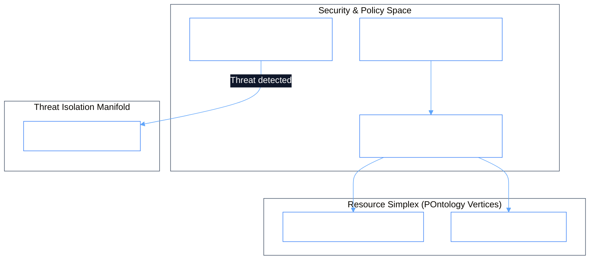

# PhiSec: Security & Vulnerability Simplicial Complex

`PhiSec` manages security policies, token authentication verification, static code scanning, and threat isolation across the topological spaces.

## 1. Simplicial Complex & Policy Ontologylogy

