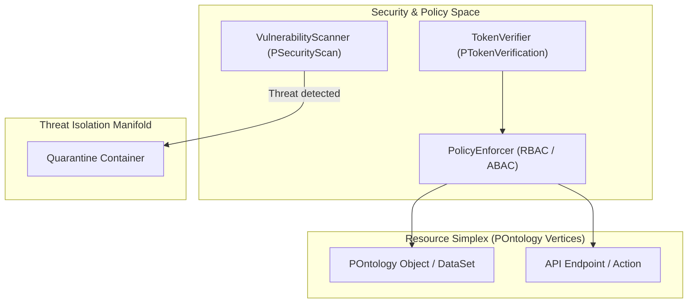

export const meta = {
  agent: "phisec",
  domain: "security",
  layer: "infrastructure",
  version: "1.0.0"
};

# PhiSec: Security & Vulnerability Simplicial Complex

PhiSec provides enterprise security governance, token authorization, vulnerability scanning, and threat isolation across topological spaces.

