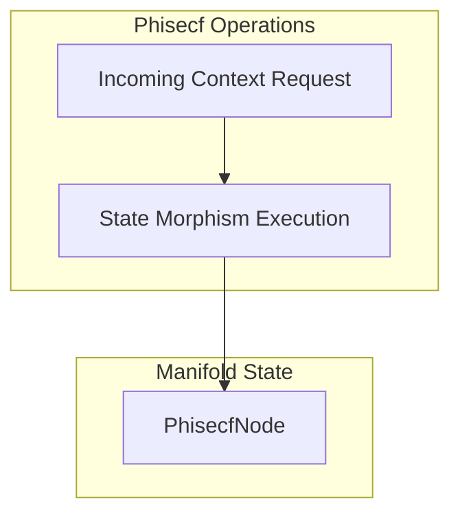

# Phisecf: security Simplicial Complex

The `Phisecf` domain agent manages the `security` manifold space.

## 1. Simplicial Complex Ontologylogy

```mermaid
graph TD
    subgraph Operations["Phisecf Operations"]
        Req["Incoming Context Request"]
        Morph["State Morphism Execution"]
    end

    subgraph State["Manifold State"]
        Node["PhisecfNode"]
    end

    Req --> Morph
    Morph --> Node
```
