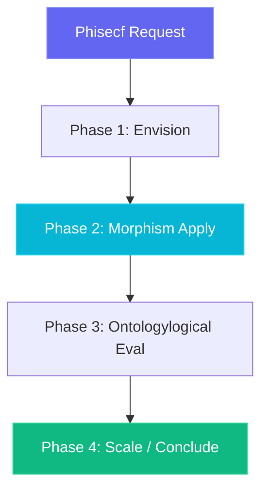

# Phisecf Ontologylogical Architecture

The **Phisecf** agent orchestrates the **security** topology space with version `1.0.0`.

## Simplicial Ontologylogy Flow

## Supported Verbs

- `scan_vulnerability`
- `audit_trail`
- `status`
