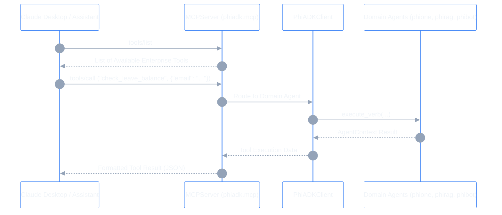

# Model Context Protocol (MCP) Server (`src/phiadk/mcp/`)

> _Direct Tool Integration for Claude Desktop, Claude Code & AI Assistants._

---

## 1. Architectural Overview & Toolchain

The `phiadk.mcp` server exposes enterprise tools directly to Large Language Models (LLMs) via the **Model Context Protocol (JSON-RPC over stdio / SSE)**:



---

## 2. Available MCP Tools

| Tool Name | Target Agent | Input Schema | Description |
|:---|:---|:---|:---|
| `search_knowledge` | `phirag` | `query: str, top_k: int = 5` | Semantic search across internal policies, runbooks, and documents. |
| `lookup_employee` | `phione` | `email: str` | Retrieve employee profile, title, department, and org structure. |
| `check_leave_balance` | `phione` | `email: str` | Get annual, sick, and parental leave balances and availability. |
| `execute_playbook` | `phibot` | `playbook_id: str, parameters: dict` | Run automated operational workflows and build playbooks. |
| `query_spatial_store`| `phiora` | `coords: list[float], k: int = 3` | Query nearest spatial entities in PhiOraDB. |
| `publish_bus_event` | `phibus` | `topic: str, payload: dict` | Broadcast an event across the PhiBus event network. |

---

## 3. Configuring in Claude Desktop

Add this configuration to your Claude Desktop config (`claude_desktop_config.json`):

```json
{
  "mcpServers": {
    "phient": {
      "command": "python",
      "args": [
        "-m",
        "phiadk.mcp.server"
      ],
      "env": {
        "PYTHONPATH": "src"
      }
    }
  }
}
```

---

## 4. Standalone Server Execution

```bash
# Run MCP server locally over stdio
python -m phiadk.mcp.server
```
