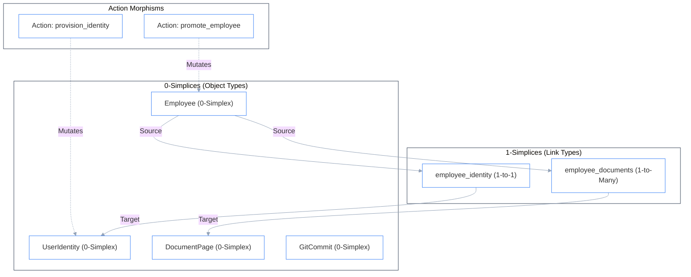

# Phient Ontologies Engine (`src/phiadk/ontologies/`)

> _1:1 Palantir Foundry Symmetrical Ontology Substrate & Topological State Machine._

[](../../../look.md)
[](./)

---

## 1. Architectural Overview & Category Theory Foundation

The **POntologyEngine** treats the entire enterprise state as a category of sheaves over a simplicial manifold:
- **0-Simplices (Vertices)**: `ObjectType` entities (e.g. `Employee`, `UserIdentity`, `DocumentPage`, `GitCommit`).
- **1-Simplices (Edges / Fiber Bundles)**: `LinkType` relationships (e.g. `employee_identity`, `authored_documents`).
- **State-Mutating Morphisms**: `ActionType` operations (e.g. `promote_employee`, `provision_identity`).
- **What-If Sandboxes**: `Scenario` copy-on-write branches.
- **Atomic Batches**: `Transaction` 2-phase commits producing SHA-1 hashes.



---

## 2. Module Symmetrical Mapping

| Module File | Exported Classes & Models | Palantir Foundry Reference |
|:---|:---|:---|
| [`engine.py`](./engine.py) | `POntologyEngine`, `OntologyEngine`, `GLOBAL_ONTOLOGY` | `foundry_sdk/v2/ontologies/ontology.py` |
| [`object.py`](./object.py) & [`ontology_object.py`](./ontology_object.py) | `ObjectType`, `ObjectProperty`, `POntologyObject` | `foundry_sdk/v2/ontologies/object_type.py` |
| [`link.py`](./link.py) & [`linked_object.py`](./linked_object.py) | `LinkType`, `PLinkType`, `LinkedObjectClient` | `foundry_sdk/v2/ontologies/linked_object.py` |
| [`action.py`](./action.py) & [`action_type.py`](./action_type.py) | `ActionType`, `PActionType`, `ActionExecutionEngine` | `foundry_sdk/v2/ontologies/action.py` |
| [`interface.py`](./interface.py) & [`ontology_interface.py`](./ontology_interface.py) | `Interface`, `POntologyInterface`, `InterfaceClient` | `foundry_sdk/v2/ontologies/ontology_interface.py` |
| [`scenario.py`](./scenario.py) & [`ontology_scenario.py`](./ontology_scenario.py) | `Scenario`, `POntologyScenario`, `ScenarioClient` | `foundry_sdk/v2/ontologies/ontology_scenario.py` |
| [`transaction.py`](./transaction.py) & [`ontology_transaction.py`](./ontology_transaction.py) | `Transaction`, `POntologyTransaction`, `TransactionClient` | `foundry_sdk/v2/ontologies/ontology_transaction.py` |
| [`geo.py`](./geo.py) & [`geotemporal_series_property.py`](./geotemporal_series_property.py) | `GeoPoint`, `GeoShape`, `GeotemporalClient` | `foundry_sdk/v2/ontologies/geotemporal_series_property.py` |
| [`timeseries.py`](./timeseries.py) & [`time_series_property_v2.py`](./time_series_property_v2.py) | `TimeSeriesProperty`, `TimeSeriesPoint`, `TimeSeriesClient`| `foundry_sdk/v2/ontologies/time_series_property_v2.py` |
| [`cipher.py`](./cipher.py) & [`cipher_text_property.py`](./cipher_text_property.py) | `CipherTextProperty`, `CipherClient` (AES-256 Vault) | `foundry_sdk/v2/ontologies/cipher_text_property.py` |

---

## 3. Python SDK Usage Example

```python
from phiadk.ontologies import GLOBAL_ONTOLOGY, ActionClient, ScenarioClient

# 1. Inspect registered ontology
print(f"Loaded {len(GLOBAL_ONTOLOGY.object_types)} ObjectTypes:")
for name, ot in GLOBAL_ONTOLOGY.object_types.items():
    print(f"  • {name} ({len(ot.properties)} properties)")

# 2. Execute an Action Morphism (automatically emits PhiBus event)
act_client = ActionClient(engine=GLOBAL_ONTOLOGY)
receipt = act_client.apply(
    action_type="promote_employee",
    parameters={"employee_id": "EMP-001", "new_title": "Lead Staff Architect"},
    branch="master"
)
print("Mutation Receipt:", receipt)

# 3. Create a What-If Scenario Sandbox
scenario_client = ScenarioClient(engine=GLOBAL_ONTOLOGY)
sandbox = scenario_client.create(name="org_restructure_simulation")
print("Sandbox Active:", sandbox.scenario_id)
```
