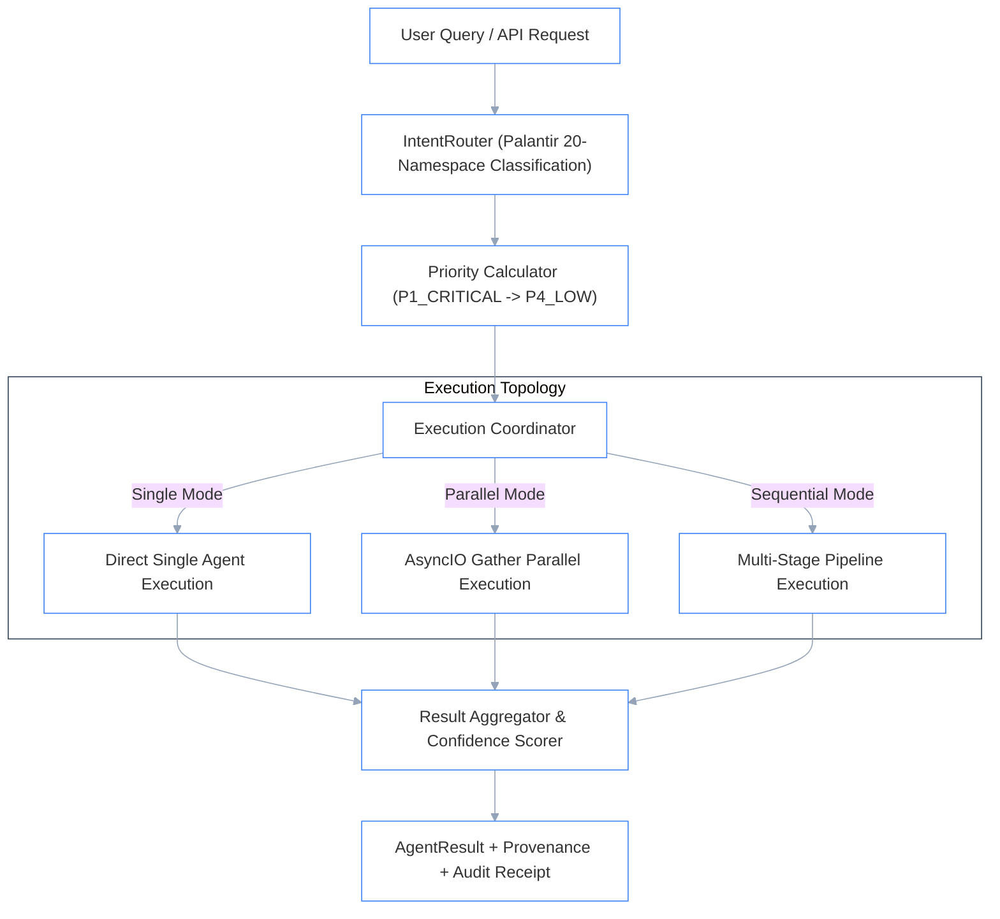

# Multi-Agent Orchestrator (`src/phiadk/orchestrator/`)

> _Palantir 20-Namespace Intent Routing, Priority Queueing & Multi-Agent Coordination._

---

## 1. Architectural Diagram & Execution Modes

The `Orchestrator` coordinates requests by classifying intent, scoring priority, resolving the appropriate Palantir namespace domain agents, and aggregating multi-agent responses:



---

## 2. Palantir Namespace Routing Map

The Orchestrator maps incoming namespace operations directly to the 15 canonical domain agents:

```python
PALANTIR_NAMESPACE_MAP = {
    "admin": "phione",                      # Admin identity, Users & Groups
    "aip_agents": "phimen",                 # Autonomous AIP Agents & Sessions
    "audit": "philog",                      # Audit trails & telemetry
    "orchestration": "phibot",              # Build schedules & DAG jobs
    "media_sets": "phirag",                 # Unstructured media & Vector RAG
    "datasets": "phiora",                   # Datasets, PhiOraDB & branch transactions
    "functions": "phical",                  # Logic & math compute functions
    "language_models": "phillm",            # LLM deployments & prompt execution
    "checkpoints": "phigov",                # Safety gates & compliance checks
    "data_health": "phisec",                # Security scans & vulnerability checks
    "connectivity": "phibus",               # Connections & stream channels
    "models": "phigen",                     # Model generation & schema parity
    "filesystem": "phigit",                 # Git filesystem & projects
    "third_party_applications": "phibrd",   # OAuth apps & client onboarding
}
```

---

## 3. Priority Framework

Requests are scored into four deterministic enterprise tiers:

| Tier | Priority Code | SLA / Target Latency | Intent Triggers |
|:---|:---|:---|:---|
| **P1** | `Priority.P1_CRITICAL` | $< 250\text{ ms}$ | Account lockouts, security breaches, outage alerts |
| **P2** | `Priority.P2_HIGH` | $< 1\text{ s}$ | Employee offboarding, permission revocations, urgent lookups |
| **P3** | `Priority.P3_STANDARD` | $< 3\text{ s}$ | Policy questions, routine leave queries, general searches |
| **P4** | `Priority.P4_LOW` | Batch / Async | Analytics reports, parity audit scans, daily aggregations |

---

## 4. Usage Example

```python
import asyncio
from phiadk.orchestrator import Orchestrator, Priority

async def main():
    orch = Orchestrator()

    # Process query through automated routing and execution
    result = await orch.process(
        query="What is the company annual leave balance policy and how do I apply?",
        user_id="jane.m@phient.com",
        priority=Priority.P3_STANDARD,
    )

    print(f"Status: {result.status}")
    print(f"Confidence: {result.confidence}")
    print(f"Output:\n{result.output}")

asyncio.run(main())
```
