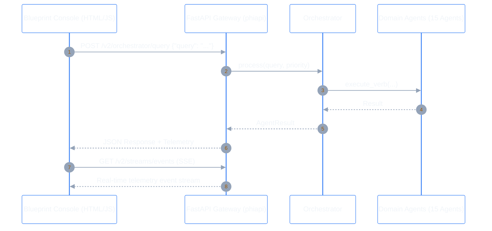

# AIP FastAPI Server & Blueprint Console (`src/phiadk/phiapi/`)

> _REST API Gateway, Server-Sent Events (SSE) Streaming & Blueprint UI Studio._

---

## 1. API Architecture

The `phiapi` module exposes the entire multi-agent ecosystem over standard HTTP REST, SSE streaming, and WebSockets:



---

## 2. Core API Endpoints

| Method | Endpoint | Description |
|:---|:---|:---|
| `GET` | `/` | Serves the AIP Blueprint Dashboard (`dashboard.html`). |
| `GET` | `/health` | System health check and uptime status. |
| `POST` | `/v2/orchestrator/query` | Submit natural language query to the 20-namespace orchestrator. |
| `GET` | `/v2/ontology/schema` | Retrieve full category-theoretic ontology schema and Mermaid graph. |
| `POST` | `/v2/ontology/action` | Apply validated Action Type morphism. |
| `POST` | `/v2/bus/pub` | Publish event on the `PhiBus` event network. |
| `GET` | `/v2/bus/events` | Query recent events from the `PhiBus` ring buffer. |
| `GET` | `/v2/streams/telemetry` | Server-Sent Events (SSE) live telemetry stream. |

---

## 3. Running the Server

```bash
# Start server on port 8000
python -m src.cli serve --port 8000
```
Open **`http://localhost:8000`** in your browser to access the interactive Blueprint Console.
