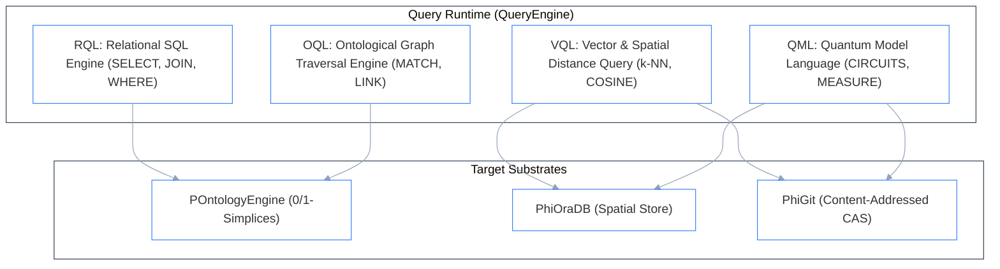

# Multi-Dialect Query Engine (`src/phiadk/query/`)

> _Multi-Language Unified Query Runtime: RQL, OQL, QML, VQL & ORM._

---

## 1. Supported Query Dialects

The `phiadk.query` runtime provides unified query builders across four distinct computational models:



---

## 2. Dialect Overview

| Dialect | Class | Target Paradigm | Example Usage |
|:---|:---|:---|:---|
| **RQL** | `RQLQueryBuilder` | Relational SQL queries | `RQL.select("name", "title").from_table("employees").where("dept", "=", "Engineering")` |
| **OQL** | `OQLQueryBuilder` | Category-theoretic ontology graph traversals | `OQL.match("Employee").traverse("employee_identity").where("status", "ACTIVE")` |
| **QML** | `QMLQueryBuilder` | Quantum circuits & state vector transformations | `QML.from_space("quantum_space").hadamard(0).measure()` |
| **VQL** | `VQLQueryBuilder` | Spatial & vector similarity search | `VQL.nearest(coords=[10.0, 20.0, 5.0], k=5)` |

---

## 3. Usage Example

```python
from phiadk.query.rql import RQL
from phiadk.query.oql import OQL

# 1. Build an RQL Relational Query
query = RQL.select("display_name", "title").from_table("Employee").where("department", "=", "Engineering")
sql_str = query.to_sql()
print("Generated SQL:", sql_str)

# 2. Build an OQL Ontological Traversal
traversal = OQL.match("Employee").traverse("employee_identity")
print("OQL AST:", traversal.to_ast())
```
