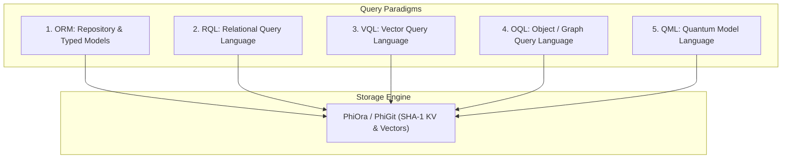

# Multi-Model Query Paradigms: ORM, RQL, VQL, OQL, QML

The `query` package implements 5 distinct query paradigms sitting over `PhiOra` and `PhiGit` content-addressed storage.

---

## 1. Query Paradigm Architecture



### Flow Diagram
```
[ Query Execution ]
        │
        ├─► client.rql("employees").select("name").where("status == 'active'").execute()
        ├─► client.vql("knowledge").near_vector([0.1, 0.9]).top_k(5).execute()
        ├─► client.oql("jane@phient.com").traverse("reports_to").execute()
        ├─► client.qml("circuit").superposition(["|00⟩", "|11⟩"]).born_measurement().execute()
        └─► repo = Repository(EmployeeModel, store); repo.filter(status="active")
```

---

## 2. Key Components

- **`orm.py`**: `Repository`, `Field`, `StringField`, `IntegerField`.
- **`rql.py`**: `RQL` fluent relational filter and projection builder.
- **`vql.py`**: `VQL` cosine vector distance solver.
- **`oql.py`**: `OQL` topological simplicial graph traverser.
- **`qml.py`**: `QML` quantum circuit simulation and Born-rule collapse.
- **`spec.md`**: Formal specification contract.
