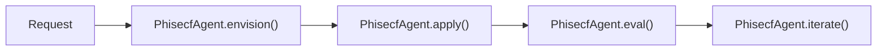

# Phisecf: security Domain Agent

`Phisecf` coordinates security topological operations and state mutations with version `1.0.0`.

---

## 1. Architectural Flow



---

## 2. Python SDK Usage

```python
from phiegg import PhiEggClient

client = PhiEggClient()
agent = client.agents["phisecf"]
print(f"Agent Version: {agent.version}")
```
